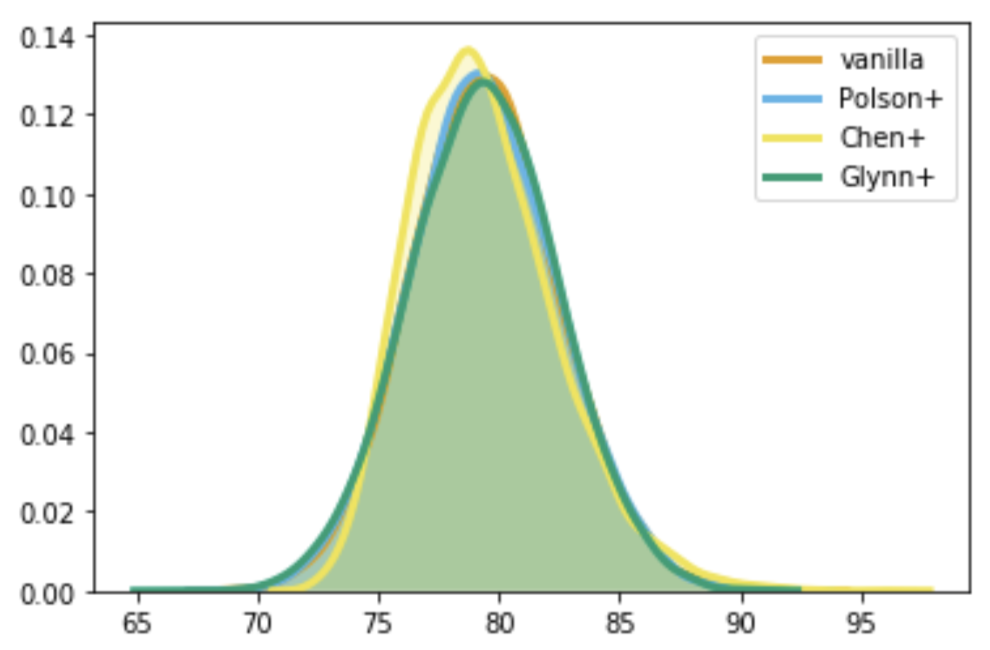

# Pólya-Gamma 分布

[Polson+, 2013] により提案された確率分布。

## 定義

$$
\begin{aligned}
\omega \ \overset{D}{=}&\dfrac{1}{2\pi^2}\sum_{k=1}^{\infty}\dfrac{g_k}{(k-1/2)^2+c^2/(4\pi^2)}\\
g_k \sim& Ga(b,1)
\end{aligned} \tag{1}$$

で表される確率変数 $\omega$ は、パラメータ $b>0,\ c\in\mathbb{R}$を持つPólya-Gamma分布に従い、$\omega \sim \mathcal{PG}(b,c)$ と表せる。

(1)の通り、ガンマ分布の無限畳み込みで定義されている。

また、逆ガウス分布の交代級数の和としても定義でき、この表記が確率変数のサンプリングにおいて重要な役割を果たす。

## $\mathcal{PG}(1,0)$：Pólya分布

$b=1, c=0$ の特殊ケースはPólya分布(Barndorff-Nielsen et al., 1982)として知られ、そのラプラス変換形式は、

$$\mathbb{E}\{\exp(-\omega t)\}=\dfrac{1}{\cosh(\sqrt{t/2})}.\tag{2}$$

## $\mathcal{PG}(b,0)$

$c=0$ の特殊ケースのラプラス変換形式は、

$$
\begin{aligned}
\mathbb{E}\{\exp(-\omega t)\}
=&\prod_{i=1}^t\left(1+\dfrac{t}{2\pi^2(k-1/2)^2}\right)^{-b}\\
=&\dfrac{1}{\cosh^b(\sqrt{t/2})}
\end{aligned} \tag{3}$$

であり、変数は以下で定義される。

$$
\begin{aligned}
\omega \ \overset{D}{=}&\dfrac{1}{2\pi^2}\sum_{k=1}^{\infty}\dfrac{g_k}{(k-1/2)^2}\\
g_k \sim& Ga(b,1)
\end{aligned} \tag{4}$$

さらに、逆ガンマ分布を用い確率密度関数は、

$$f(\omega|b,0)=\dfrac{2^{b-1}}{\Gamma(b)}\sum_{n=0}^{\infty}(-1)^n
\dfrac{\Gamma(n+b)}{\Gamma(n+1)}
\dfrac{(2n+b)}{\sqrt{2\pi\omega^3}}
e^{-\frac{(2n+b)^2}{8\omega}} \tag{5}$$

と書ける。

また、[Biane+,2001]で扱われるヤコビシータ関数に密接に関係する確率分布$J^*(b), b>0$のラプラス変換形式は、

$$\mathbb{E} \{ \exp(-tJ^*(b))\} =\dfrac{1}{\cosh^b(\sqrt{2t})}, \tag{6}$$

であることから、PG(b,0)と

$$PG(b,0)\overset{D}{=}\dfrac{1}{4}J^*(b) \tag{7}$$

という密接な関係を持つ。

## $\mathcal{PG}(b,c)$

確率密度関数は(1)のとおりだが、一般的なPG(b,c)クラスは、PG(b,c)確率密度の指数ティルティング[^1]によって、

$$p(\omega|b,c)=\dfrac{\exp(-\frac{c^2}{2}\omega)}{\mathbb{E}\{\exp(-\frac{c^2}{2}\omega)\}}p(\omega|b,0), \tag{8}$$

としても得られる。

したがって、(6)(7)より、逆ガンマ分布を用いた確率密度関数は、

$$f(\omega|b,c)=\{\cosh^b(c/2)\}
\dfrac{2^{b-1}}{\Gamma(b)}\sum_{n=0}^{\infty}(-1)^n
\dfrac{\Gamma(n+b)}{\Gamma(n+1)}
\dfrac{(2n+b)}{\sqrt{2\pi\omega^3}}
e^{-\frac{(2n+b)^2}{8\omega}-\frac{c^2}{2}\omega} \tag{9}$$

として得られる。ここで、正規化定数はPG(b,0)のラプラス変換形式から直接得られる。

## 有用な性質

PG確率変数の有限モーメントはクローズドフォームで得られ、平均は、

$$\mathbb{E}(\omega)=\dfrac{b}{2c}\tanh(c/2)=\dfrac{b}{2c}\left(\dfrac{e^c-1}{1+e^c}\right), \tag{10}$$

分散は、

$$\text{Var}(\omega)=\dfrac{b}{4c^3}\text{sech}^2(c/2)\left(\sinh(c)-c \right), \tag{11}$$

である。

また、同じスケールパラメータ$c$を持つPG確率変数の畳み込みは閉じている。
そのため、独立な$\omega_1\sim\mathcal{PG}(b_1,c)$および$\omega_2\sim\mathcal{PG}(b_2,c)$について、

$$\omega_1+\omega_2 \sim \mathcal{PG}(b_1+b_2, c), \tag{12}$$

が成り立つ。

## サンプラー
### Vanilla
(1)に従い、無限個のガンマ分布からの独立したサンプルの加重和で$\omega$は得られるため、十分に大きな数$N$を用いて、

$$
\omega \ \approx\dfrac{1}{2\pi^2}\sum_{k=1}^{N}\dfrac{Ga(b,1)}{(k-1/2)^2+c^2/(4\pi^2)}, \tag{13}$$

で近似できる。

### [Polson+, 13] の近似手法

上記の方法は遅く、また無限和を途中で切断して近似している点で危険性がある。

代替手法として、ヤコビシータ関数に密接に関連する分布$J^*(1)$[^2]の指数ティルティングを行なった$J^*(1,z)$を用い、まず、PG(1,c)からb個の独立したサンプルを得る。

その後、(10)の性質を用い、PG(1,c)からのサンプルの和を取りPG(β,c)からのサンプルを得る。

$$
\begin{aligned}
f_{J^*(1,c)}(x|z) =& \cosh(c)e^{-xc^2/2}f_{J^*(1)}(x)\\
PG(1,c) =& \dfrac{1}{4}J^*(1,c/2)\\
PG(b,c) =& \sum^b PG(1,c)
\end{aligned} \tag{12}$$

### [Chen+, 13] の近似手法

bが大きい場合、[Polson+,13]の方法では、PG(1,c)のサンプリング回数が線形に増加し計算に時間がかかる。

そのため、bより小さいmを用いPG(m,c)のサンプルを用いてPG(b,c)を以下の様に近似する。

$m < b,\ \omega\sim \mathcal{PG}(b, c),\ z\sim \mathcal{PG}(m, c)$

$$\begin{aligned}
\omega \approx f(z)
&=\sqrt{Var(\omega)/Var(z)}(z-E(z))+E(\omega)\\
&= \sqrt{b/m}\left(PG(m,c)-\frac{m}{2c}\tanh(\frac{c}{2})\right)+\frac{b}{2c}\tanh(\frac{c}{2})
\end{aligned} \tag{12}$$

$m = 1$の場合、

$z \sim PG(1,c)$

$f(z)=\sqrt{b}\left(z-\frac{1}{2c}\tanh(\frac{c}{2})\right)+\frac{b}{2c}\tanh(\frac{c}{2})$

$PG(b,c)=\sqrt{b}\left(PG(1,c)-\frac{1}{2c}\tanh(\frac{c}{2})\right)+\frac{b}{2c}\tanh(\frac{c}{2})$

### [Glynn+, 19] の近似手法

bが大きい場合を想定し、中心極限定理に基づき、PG(b,c)の期待値と分散を用いて正規分布からのサンプル生成を行う。

$$\omega \sim \mathcal{N}(\mathbb{E}(\omega), \text{Var}(\omega))$$

### サンプリング例
上記の各近似手法を実装してPG(b=40, c=-1.81)からのサンプリングを行った結果

## References

- Polson, N.G., Scott, J.G. & Windle, J. Bayesian inference for logistic models using Polya-gamma latent variables. J. Am. Stat. Assoc. 108, 1339–1349 (2013).
- J. Chen, J. Zhu, Z. Wang, X. Zheng and B. Zhang, "Scalable inference for logistic-normal topic models", NIPS, pp. 2445-2453, 2013.
- Glynn, C., S. T. Tokdar, B. Howard, and D. L. Banks (2019, 03). Bayesian analysis of dynamic linear topic models. Bayesian Anal. 14(1), 53–80.
## Footnotes

[^1]: 棄却サンプリングやインポータンスサンプリングで使用される分布シフト手法。
[^2]: [Polson+, 13]では$J^*(1)$をヤコビ分布と呼んでいる。

